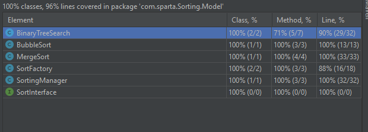

# Sorting manager

This is an application that takes in an array, and sorts them in the way chosen by the user by a predefined set of sorting methods. There is no max size on the size of the array, and multiple methods can be ran on the array, each one will display the type used, the result and the time that it took to complete the sort. You can also view some premade examples. Using array size of 10,100,1000 for each of the sorts if you wish. These can be modified to increase the size by just changing the array size

[How to Use it](#how-to-use-it)

[The sorting methods](#the-sorting-methods)

[How to add extras](#how-to-add-extras)

[Timing](#timing)

[Testing](#testing)

[Dependancies](#dependancies)

[How the manager was made](#how-the-manager-was-made)

## How to use it
Clone a copy to your local machine, and run the display manager. You will need to enter a few pieces of information. The first is the amount of sorting types you would like to use. You can use every one if you would like, however the system will not run the same sort multiple times. 
Then it will request the amount of numbers you would like to sort, followed by the elements that need sorting. The size of the list needs to be more than 0 or it will not continue.
## The Sorting Methods
The following are the available different sorting methods:

-Bubble Sort

-Merge Sort

-Binary Tree Sort
## How to add extras
If you wish to add your own methods, this is fairly simple. The first is to make sure that the class you create inherits the SortInterface and implements all the methods. The getInstance method should return a new instance of your class and you should override toString with the name of your sorting type.
You will need to make sure that the Sort Factory has the name of the method included in the enum, and it is added to the return sort method.

If this is done, the user interface should be able to pick up this is availabe and show it to the user.
## Timing
For each method you can get back timing information from the array and 
sort type you have selected. As mentioned above, you can also choose to run
tests from the Timing file. These are set to 10,100, 1000 so you can see how the
time changes as the array gets much bigger. You can make these bigger if you so wish.
## Testing
Testing has been done through the model view with a 90% code coverage. Testing was done on each of the classes individually, then again on the sorting manager and factory to make sure the classes are used properly.
User interface is not covered in this but has gone through manual testing.
Below you can see the results of the tests done on the Model Class.

Within the mylogfile.Log you can see previous tests ran, and all futher tests should be shown there. Info is provided for the information on timing from array inputted by the user at run time. Some timing tests have been provided with large sets of Ints that you can see under the tag of Warn.
## Dependancies

The Project has two different main dependancies, these are JUnit and log4j. JUnit is included as this runs the testing methods that have been included to make sure the system is working as it should. Log4j has been included so that we can log the information that is run.
## How the manager was made
The manager has been made in three parts, the View, the Controller and the Model across 5 different phases.

## First Phase
The first phase was to implement the Bubble and merge sort. An interface was used to normalise the sorting methods for future proofing. 
## Second Phase
After that, a Factory was also added to again try and help with future proofing, at this stage the project was split into MVC and managers were created to control the different parts.
## Third Phase
After this timing was added to show the user the speed of the different classes. As well as some general speed tests on the different methods. The user input was completed except a few bugs, and used information from the Sort Factory to remove any additional changes later one.
## Fourth Phase
Next Logging was added, Each of the methods ran are now logged, with what was ran and the speed for recording information. Warn is used to highlight any speed tests that are done with Info used to show results of user inputter information.
## Fifth Phase
The last phase was to add the Binary Tree Sort and additional testing on it. As the factory and interface was set up properly, this was rather simple to intergrate into the system. A testing class was also set up for this.
